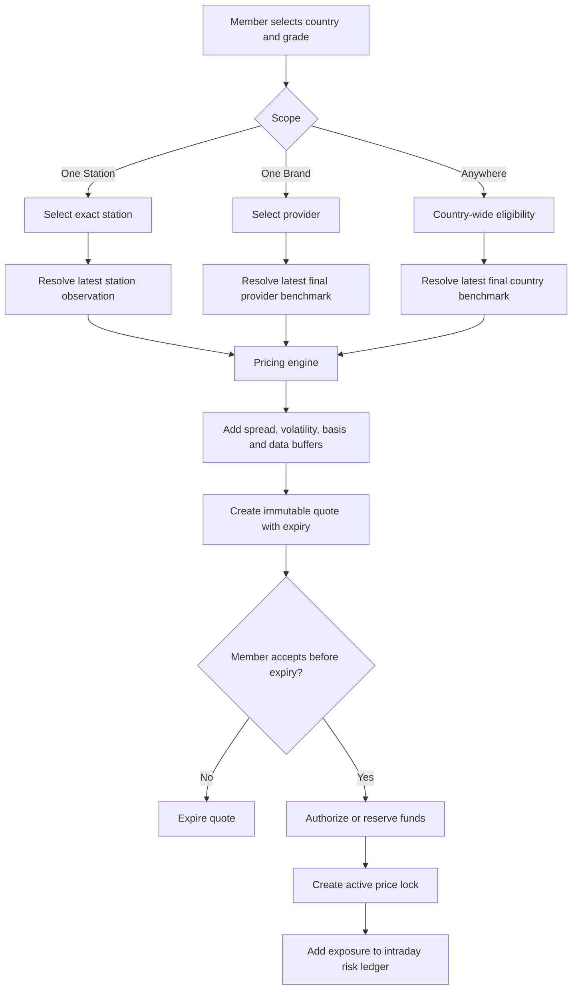
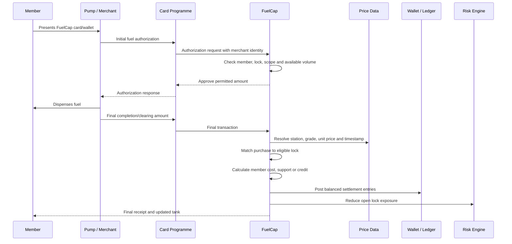
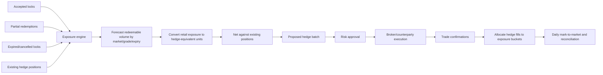
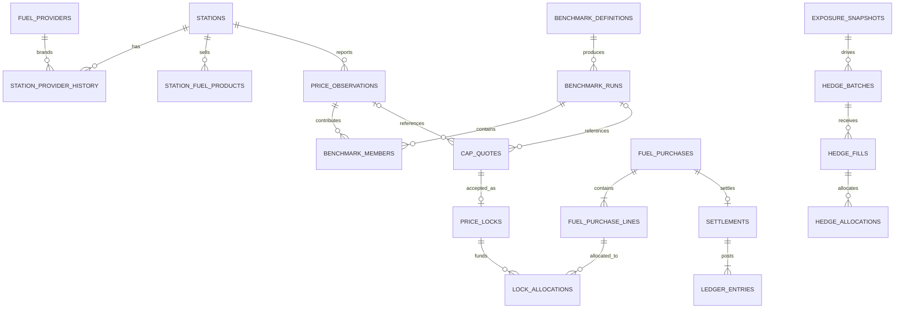

# FuelCap System Workflow and Pricing Architecture

Status: proposed target design based on the prototype as of 24 July 2026.

This document separates four values that the prototype currently treats as one:

1. **Reference price**: an observed or calculated market input.
2. **FuelCap price**: the binding maximum unit price promised to the member.
3. **Pump price**: the actual unit price charged by the eligible forecourt.
4. **Hedge price**: the wholesale instrument price used to reduce FuelCap's
   aggregate exposure.

They must remain separate in the database, app, settlement engine, accounting
ledger, and risk reports.

## 1. Executive decision

FuelCap should show the member a binding **FuelCap price**, not describe it as
the current pump price.

The end-of-day hedge does not determine what is shown to the member. It is a
back-office risk action performed after FuelCap has issued binding quotes during
the day. The interval between accepting a lock and executing the hedge is
intraday exposure carried by the risk pool.

At redemption, the app should show:

- the binding FuelCap price;
- the actual forecourt and actual pump price;
- the protected volume used;
- a FuelCap top-up if the pump price exceeded the cap; or
- a price-drop credit if the pump price was below the cap.

The member's final economic unit price is:

```text
member_unit_price = min(actual_pump_unit_price, locked_cap_unit_price)
```

For redeemed volume `q`:

```text
merchant_payment   = q * actual_pump_unit_price
member_cost        = q * min(actual_pump_unit_price, locked_cap_unit_price)
cap_support        = q * max(actual_pump_unit_price - locked_cap_unit_price, 0)
price_drop_credit  = q * max(locked_cap_unit_price - actual_pump_unit_price, 0)
```

This formula is stable regardless of when FuelCap hedges.

## 2. Member scope choices

### 2.1 Specific station

The member selects one exact forecourt and fuel grade.

- **Eligibility**: redemption only at that `station_id`.
- **Quote reference**: the latest valid price observation for that station and
  grade.
- **Starting cap**: lowest because geographic and basis risk are narrowest.
- **App label**: `Capped at Shell, 123 Main Street`.
- **Pump display**: latest reported station price, source time, and freshness.

This is the simplest product to explain and settle.

### 2.2 Fuel provider

The member selects a fuel brand/provider, for example Shell or BP.

- **Eligibility**: any active station mapped to that provider in the country.
- **Quote reference**: the provider's finalized nationwide benchmark for the
  selected grade.
- **Starting cap**: higher than a station-specific cap because it covers more
  locations and more retail basis variation.
- **App label**: `Capped at Shell stations across the UK`.
- **Redemption check**: the transacting station's provider relationship must
  have been valid at the purchase timestamp.

Provider, brand, station owner, and station operator are not interchangeable.
The station-provider relationship needs effective dates and source evidence.
UK guidance, for example, distinguishes the fuel brand sold at a station from
the station owner.

### 2.3 Any eligible station

The member may redeem at any covered station/provider in the selected country.

- **Eligibility**: any active eligible station in that country.
- **Quote reference**: the finalized country-wide benchmark for the grade.
- **Starting cap**: highest because it includes maximum geographic, provider,
  tax, and retail-margin basis risk.
- **App label**: `Capped at any eligible UK station`.
- **Redemption check**: station, country, grade, data quality, and programme
  participation must all be valid.

### 2.4 Recommended product names

| Internal scope | Customer-facing name | Eligible redemption |
| --- | --- | --- |
| `station` | One Station | One selected forecourt |
| `provider` | One Brand | Any covered station for that brand |
| `country` | Anywhere | Any covered station in the country |

The scope must be fixed on acceptance. Changing it creates a new quote and lock.

## 3. The end-of-day maximum problem

A final "highest price for today" does not exist until the day and data
submission window have closed. FuelCap therefore cannot show a binding final
same-day maximum earlier in that day.

There are three technically valid approaches:

### Option A: previous finalized day, effective today

At the end of Day D, calculate and finalize each provider/country benchmark.
Use that value for locks issued on Day D+1.

```text
Day D observations -> Day D final benchmark -> Day D+1 member quotes
```

Advantages:

- deterministic and auditable;
- no retrospective changes to accepted locks;
- straightforward end-of-day hedging.

Disadvantage:

- one-day lag during fast price movements, priced through a volatility buffer.

This is the recommended MVP method.

### Option B: running intraday maximum plus buffer

Use the maximum of all accepted observations received so far that day, then add
a volatility/data-completeness buffer.

Advantages:

- reacts during the day;
- can issue binding quotes continuously.

Disadvantages:

- the running maximum can only rise;
- incomplete station coverage early in the day;
- bad data or a single extreme motorway station can distort the quote.

Once accepted, the member's cap cannot be retrospectively raised if the final
daily maximum is higher.

### Option C: quote after the daily cutoff

Collect lock requests during the day and confirm the price only after the
benchmark is finalized.

This removes the uncertainty but is a poor member experience because the price
is not locked when the member taps the button. It should not be the primary
product.

## 4. Benchmark calculation

The phrase "highest national price" should mean **highest eligible verified
price**, not the unfiltered maximum database value.

For each market date, country, provider scope, and fuel grade:

1. Establish the local-time cutoff.
2. Select the latest observation per eligible station at or before cutoff.
3. Exclude observations outside the freshness limit.
4. Exclude closed, suspended, or non-participating stations.
5. Validate currency, unit, grade, tax inclusion, and provider mapping.
6. Quarantine impossible jumps, duplicates, and malformed values.
7. Calculate the benchmark over the accepted station set.
8. Record station count, excluded count, coverage percentage, and lineage.
9. Mark the run `preliminary`.
10. Finalize after the late-data window and dual-control review.

Recommended benchmark fields:

```text
scope_type       station | provider | country
scope_id         station_id | provider_id | country_code
market_date      local date represented
effective_from   when quotes may use it
effective_until  when it expires
method           station_latest | verified_max | percentile | formula
value            normalized unit price
station_count    accepted stations
coverage_ratio   accepted / expected stations
status           running | preliminary | final | corrected | void
lineage_hash      immutable hash of included observations
```

The raw maximum is commercially conservative but fragile. Before launch,
FuelCap should compare it with a high percentile plus explicit tail buffer.
Using a maximum may make One Brand and Anywhere locks materially less attractive
than local pump prices.

## 5. Quote workflow



Every quote must contain:

- scope and eligibility rule;
- source observation or benchmark run;
- fuel grade, currency, and unit;
- reference price;
- each pricing component and final cap price;
- quote creation/expiry timestamps;
- protected volume and lock expiry;
- terms version;
- model version;
- data-quality status.

The prototype's fixed subtraction of 45 cents, 8 cents, or 7 pence is not a
production pricing model. It must be replaced by a versioned pricing decision.

## 6. What the app displays

### Before a lock

For One Station:

```text
FuelCap price             £1.429/L
Shell, High Street        £1.439/L
Station price updated     8 minutes ago
Valid for                 60 seconds
```

For One Brand:

```text
FuelCap price             £1.489/L
Use at                    Covered Shell stations in the UK
Price basis               Shell UK verified maximum, 23 Jul
Benchmark status          Final
Valid for                 60 seconds
```

For Anywhere:

```text
FuelCap price             £1.529/L
Use at                    Any eligible UK station
Price basis               UK verified maximum, 23 Jul
Benchmark status          Final
Valid for                 60 seconds
```

Do not label a national/provider benchmark as `Live pump price`. Use:

- `Latest station price` for a station observation;
- `Price basis` for provider/country benchmarks;
- `FuelCap price` for the binding member cap.

### After a lock

Always show the scope next to the cap:

```text
Your FuelCap price        £1.489/L
Where it works            Covered Shell stations in the UK
Protected volume          160 L
Expires                   22 Aug 2026
```

### During and after a fill

An automated fuel dispenser may authorize an initial amount before the final
transaction is known. The app should show `Fill in progress` until the final
sale-completion/clearing amount and fuel detail are available.

Final receipt:

```text
Actual Shell pump price   £1.539/L
Your FuelCap price        £1.489/L
Volume                    42.00 L
Paid to station           £64.64
Charged to your tank      £62.54
FuelCap covered           £2.10
```

If the pump price is lower:

```text
Actual Shell pump price   £1.439/L
Your FuelCap price        £1.489/L
Volume                    42.00 L
Charged to your tank      £60.44
Price-drop credit         £2.10
```

## 7. Purchase, matching, and settlement workflow



Card clearing normally provides the final monetary amount, but it may not
provide trustworthy fuel grade, volume, or posted unit price. FuelCap therefore
needs one of:

1. direct partner POS line-item data;
2. enhanced card/merchant data containing fuel detail;
3. a digital receipt integration; or
4. a controlled fallback that matches the merchant to the nearest valid station
   price observation at the purchase timestamp.

The fallback must have a tolerance, confidence score, and exception process. A
total card amount alone is insufficient to prove unit price and volume.

## 8. Lock matching rules

The settlement engine evaluates candidate active locks in this order:

1. same member;
2. same country and currency;
3. same fuel grade;
4. unexpired with remaining volume;
5. eligible scope at purchase time;
6. highest-priority member allocation rule;
7. oldest-expiring eligible lock first by default.

Scope eligibility:

```text
station  -> purchase.station_id = lock.station_id
provider -> station provider at purchase time = lock.provider_id
country  -> purchase.country_code = lock.country_code
```

A member cannot use a station lock at another branch of the same brand.
A provider lock cannot be used where the forecourt merely shares an owner but
sells another fuel brand.

## 9. End-of-day exposure and hedging

FuelCap is not hedging each retail station's full posted pump price. A wholesale
gasoline/diesel instrument covers the correlated commodity component. Taxes,
retail margin, location, provider, grade, timing, currency, and redemption
behaviour remain basis risk.



Recommended exposure buckets:

```text
country
currency
fuel grade/formulation
scope type
provider or region where material
lock expiry band
expected redemption date band
```

Daily process:

1. Freeze an exposure snapshot at the risk cutoff.
2. Forecast expected redeemed volume, not only sold lock volume.
3. Calculate cap delta and stress loss under approved price shocks.
4. Map exposure to the available wholesale instrument.
5. Calculate residual basis-risk and liquidity reserves.
6. Net required hedge against current positions.
7. Create a proposed hedge batch.
8. Require maker/checker approval.
9. Execute with the broker or hedge counterparty.
10. Import fills and fees.
11. Allocate fills to exposure buckets.
12. Reconcile broker, bank, risk, and general-ledger records.
13. Monitor next-day slippage and unhedged exposure.

For US gasoline, RBOB futures are quoted per gallon but represent a wholesale
blendstock and use a 42,000-gallon contract. They are not a direct hedge for
every station's retail price. Other markets require their own approved
instruments, forwards, swaps, supplier contracts, or an insurer/reinsurer layer.

## 10. Target domain schema



### Reference-data layer

#### `fuel_providers`

```text
id, legal_name, display_name, country_code, status
```

#### `stations`

```text
id, external_reference, name, address, latitude, longitude,
country_code, timezone, operator_name, status, opened_at, closed_at
```

#### `station_provider_history`

```text
station_id, provider_id, brand_name, valid_from, valid_until,
source_name, source_record_id
```

#### `station_fuel_products`

```text
station_id, fuel_grade, local_product_name, currency, unit,
tax_inclusive, status
```

### Price-data layer

#### `price_observations`

```text
id, station_id, fuel_grade, unit_price, currency, unit,
observed_at, received_at, source_name, source_record_id,
quality_status, quality_flags, supersedes_id
```

Observations are immutable. Corrections create a new record.

#### `benchmark_definitions`

```text
id, scope_type, country_code, provider_id, fuel_grade,
method, cutoff_local_time, late_data_window, freshness_limit,
minimum_coverage, version, status
```

#### `benchmark_runs`

```text
id, definition_id, market_date, value, currency, unit,
station_count, excluded_count, coverage_ratio, status,
calculated_at, finalized_at, lineage_hash
```

#### `benchmark_members`

```text
benchmark_run_id, price_observation_id, included, exclusion_reason
```

### Quote and lock layer

#### `cap_quotes`

```text
id, user_id, scope_type, country_code, station_id, provider_id,
fuel_grade, volume, currency, unit, reference_price,
spread, volatility_buffer, basis_buffer, data_buffer,
cap_unit_price, source_observation_id, benchmark_run_id,
pricing_model_version, terms_version, created_at, expires_at,
status
```

Exactly one source applies:

- station scope -> `source_observation_id`;
- provider/country scope -> `benchmark_run_id`.

#### Expanded `price_locks`

```text
id, quote_id, user_id, scope_type, country_code, station_id,
provider_id, fuel_grade, volume, remaining_volume,
locked_unit_price, currency, unit, status,
effective_at, expires_at, accepted_at
```

### Purchase and settlement layer

#### `fuel_purchases`

```text
id, user_id, card_transaction_reference, merchant_id,
station_id, provider_id_at_purchase, country_code,
authorization_amount, final_amount, currency,
authorized_at, completed_at, match_status, confidence_score,
status
```

#### `fuel_purchase_lines`

```text
id, purchase_id, fuel_grade, volume, unit, actual_unit_price,
price_source, price_observation_id, tax_amount
```

#### `lock_allocations`

```text
id, purchase_line_id, lock_id, allocated_volume,
actual_unit_price, locked_unit_price, member_cost,
cap_support, price_drop_credit
```

#### `settlements`

```text
id, purchase_id, status, merchant_amount, member_amount,
cap_support_amount, credit_amount, calculated_at,
finalized_at, calculation_version
```

#### `ledger_entries`

```text
id, journal_id, account_code, user_id, purchase_id, lock_id,
currency, amount, direction, created_at
```

The ledger is double-entry. The current `transactions` table is a member
activity feed, not sufficient financial books and records.

### Risk and hedge layer

#### `exposure_snapshots`

```text
id, as_of, bucket_key, gross_locked_volume, expected_redeemed_volume,
unhedged_delta, stress_loss, model_version
```

#### `hedge_batches`

```text
id, exposure_snapshot_id, market, instrument, side,
target_quantity, status, proposed_by, approved_by,
approved_at, executed_at
```

#### `hedge_fills`

```text
id, hedge_batch_id, counterparty_reference, quantity,
price, fee, currency, executed_at
```

#### `hedge_allocations`

```text
hedge_fill_id, exposure_bucket, allocated_quantity
```

#### `data_quality_events`

```text
id, source_record_id, station_id, event_type, severity,
details, detected_at, resolved_at, resolved_by
```

## 11. State machines

### Quote

```text
draft -> offered -> accepted
               \-> expired
               \-> withdrawn
```

### Lock

```text
pending_funds -> active -> partially_redeemed -> redeemed
                    \-> expired
                    \-> cancelled
                    \-> suspended
```

### Purchase

```text
authorized -> completed -> enriched -> matched -> settled
                  \-> reversed
                  \-> exception -> manually_resolved
```

### Benchmark

```text
running -> preliminary -> final
                    \-> void
              final -> corrected
```

Final benchmarks are immutable. A correction creates a new version and does not
rewrite accepted member locks.

### Hedge batch

```text
proposed -> approved -> executing -> executed -> allocated -> reconciled
       \-> rejected
                         \-> partially_filled
                         \-> failed
```

## 12. Required invariants and controls

1. An accepted cap price never changes retrospectively.
2. A lock has exactly one immutable accepted quote.
3. Scope eligibility is evaluated at the purchase timestamp.
4. Allocated volume cannot exceed purchase volume.
5. Total allocations cannot exceed lock remaining volume.
6. A purchase is settled once; corrections use reversing entries.
7. No benchmark is final without minimum data coverage.
8. Corrected observations and benchmarks retain full lineage.
9. Hedge execution requires dual control and cannot alter customer locks.
10. Retail basis risk is measured separately from commodity hedge performance.
11. App text never presents stale or benchmark data as a live pump price.
12. Every displayed price includes source, timestamp, unit, currency, and status.

## 13. Current prototype gaps

| Area | Current prototype | Required target |
| --- | --- | --- |
| Price source | One synthetic snapshot per market | Station-level immutable observations |
| Provider | Station name text only | Canonical provider and effective mapping |
| Scope | Market only | Station, provider, or country |
| Quote | Fixed discount in code/SQL | Immutable versioned quote decision |
| Benchmark | None | Running, preliminary, and final daily runs |
| Pump price | Seed value labelled live | Station observation plus actual purchase price |
| Purchase | Manual QR simulation | Authorization, completion, enrichment, matching |
| Settlement | Negative activity row | Allocation, settlement, and double-entry ledger |
| Hedge | None | Exposure snapshots, hedge batches, fills, reconciliation |
| Exceptions | None | Data and settlement exception queues |

The current RPCs are appropriate only for demonstrating persistence. They
should not be extended into the production pricing engine.

## 14. Recommended delivery sequence

### Phase 1: station-level truth

1. Add providers, stations, provider history, and price observations.
2. Ingest one authoritative market feed.
3. Add freshness and data-quality controls.
4. Replace `Live pump price` with accurate source/status copy.
5. Implement One Station quotes and locks.

### Phase 2: purchase truth

1. Integrate a sandbox card programme or partner POS feed.
2. Model authorization and final completion separately.
3. Resolve station identity and line-item fuel detail.
4. Implement purchase-to-lock matching.
5. Add settlement calculations and balanced ledger entries.

### Phase 3: broad scopes

1. Add benchmark definitions and daily runs.
2. Operate benchmarks in shadow mode and measure data completeness.
3. Launch One Brand after provider mapping is reliable.
4. Launch Anywhere only after basis-risk results are acceptable.

### Phase 4: risk and hedge

1. Create exposure snapshots and redemption forecasts.
2. Run shadow hedge calculations without trading.
3. Reconcile model results against observed retail outcomes.
4. Add approval, counterparty execution, allocation, and accounting.
5. Launch financial hedging only with qualified legal, risk, treasury, and
   accounting sign-off.

## 15. Source notes

- UK Fuel Finder provides station-by-station prices and requires price changes
  to be reported within 30 minutes:
  <https://www.gov.uk/government/collections/road-fuel-price-data-scheme>
- The CMA reports meaningful local price variation, confirming that a national
  or provider price is not interchangeable with a station price:
  <https://www.gov.uk/government/news/cma-publishes-latest-monitoring-report-on-road-fuel-market>
- US retail prices vary with taxes, formulation, distribution, local operating
  costs, ownership, and competition:
  <https://www.eia.gov/energyexplained/gasoline/factors-affecting-gasoline-prices.php>
- RBOB futures can hedge gasoline price movement but represent wholesale
  blendstock rather than a specific station's finished retail price:
  <https://www.eia.gov/finance/markets/products/prices.php>
- CME's standard RBOB contract is quoted per gallon with a 42,000-gallon
  contract unit:
  <https://www.cmegroup.com/markets/energy/refined-products/rbob-gasoline.contractSpecs.html>
- Automated fuel dispenser processing distinguishes initial authorization from
  the final amount of fuel pumped:
  <https://usa.visa.com/dam/VCOM/global/support-legal/documents/visa-partial-authorization-service.pdf>

This architecture is a product and engineering design, not legal, regulatory,
tax, accounting, actuarial, or investment advice. Those workstreams must approve
the production design before real customer funds or hedges are introduced.
